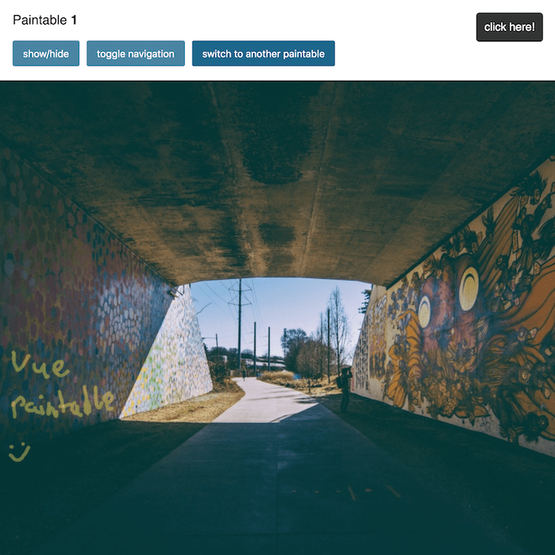

# vue-paintable [](https://www.npmjs.com/package/vue-paintable) [](https://travis-ci.org/ph1p/vue-paintable) [](https://vue-paintable.now.sh/)

With this vue plugin and component you can add a paintable canvas through your page.
All paintings are saved by default into localStorage.


<p align="center">
  <a target="_blank" href="https://vue-paintable.now.sh">
    
  </a>
</p>

### How to use?

```bash
npm install vue-paintable
```

or

```bash
yarn add vue-paintable
```

Inside your main (typically main.js)

```javascript
import Vue from 'vue';
import Paintable from 'vue-paintable';

Vue.use(Paintable, {
  // optional methods
  setItem(key, image) {
    localStorage.setItem(key, image);
  },
  // you also can use async
  getItem(key) {
    return localStorage.getItem(key);
  },
  removeItem(key) {
    localStorage.removeItem(key);
  }
});
//...
```

#### Inside your components

```html
<template>
  <paintable
    alwaysOnTop
    :active="isActive"
    :width="800"
    :height="800"
    :disableNavigation="disableNavigation"
    :hide="hidePaintable"
    :horizontalNavigation="true"
    :navigation="navigation"
    :name="isFirstPaintable ? 'my-screen' : 'my-second-screen'"
    :factor="1"
    :lineWidth="dynamicLineWidth"
    :lineWidthEraser="20"
    :useEraser="useEraser"
    :color="color"
    class="paint"
    ref="paintable"
    @toggle-paintable="toggledPaintable"
  >
    Your content
    <router-view></router-view>
  </paintable>
</template>
```

### Navigation

Set your own navigation content by adding an object to your `<paintable>` component.

```javascript
{
  'draw-save': {
    body: 'draw',
    activeBody: '<strong>save</strong>'
  },
  color: {
    body: 'CP'
  }
}
```

**Display navigation horizontal**

To display the navigation horizontally add `horizontalNavigation` to prop list.

**Available navigation items:**

- color
- line-width
- undo
- redo
- delete
- cancel

**has active state (activeBody):**

- draw-save
- eraser-pencil

### Custom Navigation

To use a custom navigation disable the default navigation with `disableNavigation`.

#### use \$refs to call paintable methods

```html
<paintable ref="paintable">content</paintable>

<button @click="$refs.paintable.undoDrawingStep">undo</button>
<button @click="$refs.paintable.redoDrawingStep">redo</button>
<button @click="$refs.paintable.clearCanvas">clear</button>
<button @click="$refs.paintable.saveCurrentCanvasToStorage">
  save
</button>
<button @click="$refs.paintable.cancelDrawing">cancel</button>
```

Take a look at the [demo](https://vue-paintable.now.sh/) (`/src/App.vue`)


### Props

| name                 | type                            | required | default                                                                  | description                                                    |
| -------------------- | ------------------------------- | -------- | ------------------------------------------------------------------------ | ---------------------------------------------------------------|
| name                 | string - required               | true     | -                                                                        | unique identifier                                              |
| showUndoRedo         | boolean                         | false    | true                                                                     | show undo and redo button                                      |
| hide                 | boolean                         | false    | false                                                                    | hide the complete paintable                                    |
| colors               | Array of colors (rgb, hex etc.) | false    | ['black', '#f00', '#4481c7', 'rgba(255, 235, 59, 0.4)', '#999', 'green'] | array of choosable colors                                      |
| width                | number                          | false    | window.innerWidth                                                        | canvas width                                                   |
| height               | number                          | false    | window.innerHeight                                                       | canvas height                                                  |
| showLineWidth        | boolean                         | false    | true                                                                     | show button to set line width                                  |
| lineWidth            | number                          | false    | 5                                                                        | line width                                                     |
| alwaysOnTop          | boolean                         | false    | true                                                                     | set canvas always as top layer                                 |
| factor               | number                          | false    | 1                                                                        | set a scale factor if needed                                   |
| lineWidthEraser      | number                          | false    | 20                                                                       | set eraser line width                                          |
| horizontalNavigation | boolean                         | false    | true                                                                     | display the navigation horizontally or vertically              |
| disableNavigation    | boolean                         | false    | false                                                                    | hide navigation                                                |
| active               | boolean                         | false    | false                                                                    | set paintable active/inactive                                  |
| color                | string                          | false    | #000                                                                     | current color                                                  |
| useEraser            | boolean                         | false    | false                                                                    | set to true, to use the eraser                                 |
| threshold            | number                          | false    | 0                                                                        | set the threshold on which an event gets triggered (see events)|

### Events

| name             | type    | description                                          |
| ---------------- | ------- | ---------------------------------------------------- |
| toggle-paintable | boolean | Is emitted, when changing paintable state            |
| thresholdReached | boolean | Is emitted, when the speciefied threshold is reached |

```html
<paintable @toggle-paintable="toggledPaintable"></paintable>

<paintable :threshold="10" @thresholdReached="thresholdReached"></paintable>
```

### development

If you want to develop with this plugin, follow these steps:

- clone repo
- run `yarn install` or `npm install`
- run `yarn serve` or `npm run serve`

### build

You can find all built files inside the `dist` folder.

- run `yarn build` or `npm run build`
